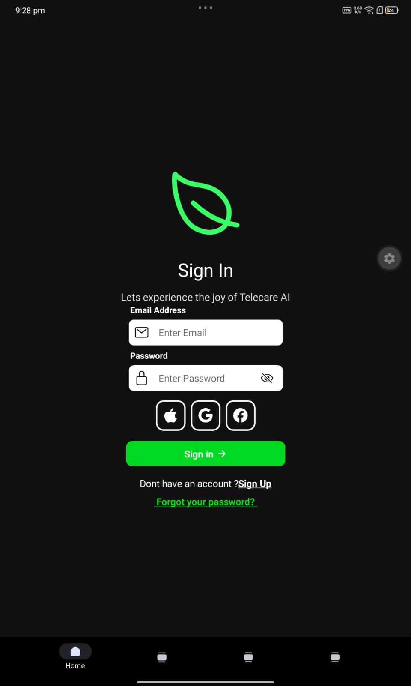
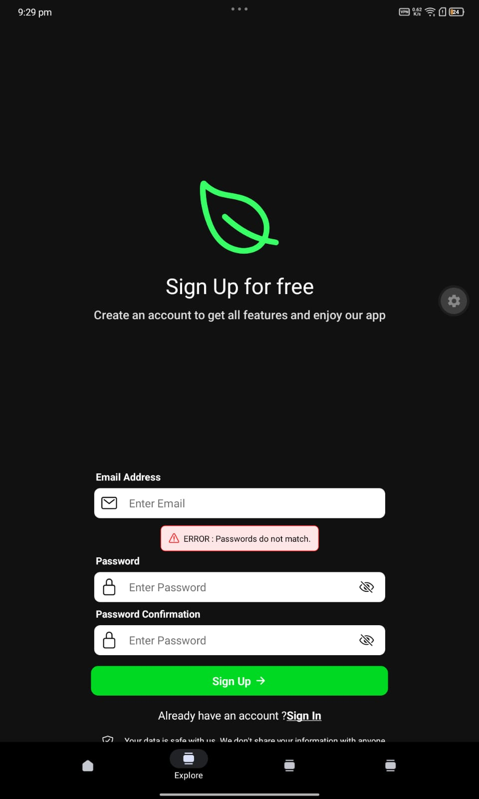
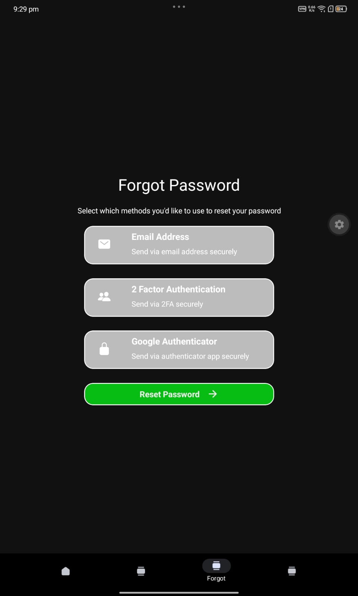
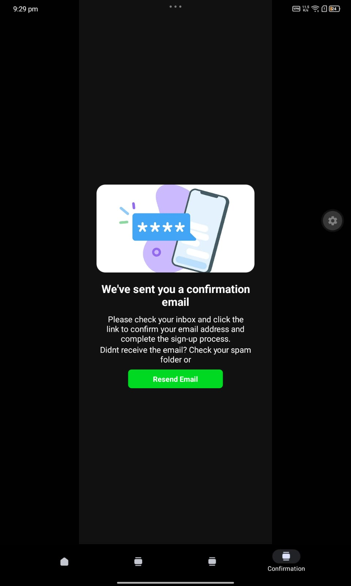

#### About :
 This is a simple UI clone project assignment 

### Images 
Here is Screenshot of each screen 

- after moving on to screen 2 after creating 1st one , i thought to reuse TextInput component instead of pasting the code , so i moved the EmailInput and PasswordInout into component/  

- similarly in Screen 3 ( Forgot Password )
just simply created a component and used it for each method . 

1. Technology used 
   - React Native For UI 
   - Ionicons for icons 

2. Things i learn while writing this readMe.md 
   - Every Html tags can be used in markdown files , and i used it for attaching screenshots above 
   
